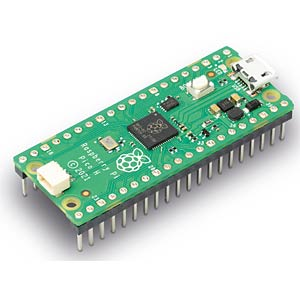

# 🪁 pico-rs 🦀

 

    

 

Writing Zephyr applications in Rust. Support for Rust is provided by the [zephyr-rs](https://github.com/adoerr/zephyr-rs) Zephyr module.

The [zephyr-rs](https://github.com/adoerr/zephyr-rs) module is currently included as a [west project](https://docs.zephyrproject.org/latest/develop/west/basics.html#west-workspace). It could also be added to a Zephyr workspace instead.

🚫 This project is for educational and explorative purposes only. 🚫

 

## Applications

- [hello-world](./hello-world/) - A basic Zephyr app

 

## Hardware

The only supported architecture is [Arm Cortex-M0+](https://developer.arm.com/Processors/Cortex-M0-Plus)
using a [(Armv6-M)](https://developer.arm.com/documentation/ddi0419/latest/) ISA. The only supported board is the
[Raspberry Pi Pico](https://www.raspberrypi.com/products/raspberry-pi-pico/). For quality of life reasons,
make sure you get the [Debug Probe](https://www.raspberrypi.com/products/debug-probe/) as well.

 

    

 

## Console

`screen -L /dev/tty.usbmodemxxx 115200 -L`

Quit with `Ctrl-A + Ctrl-\`

 

<b>🚧 pico-rs is under construction - a hardhat 👷 is recommended beyond this point 🚧</b>

